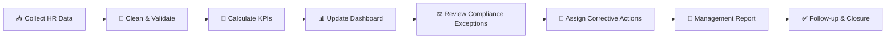

# 📘 Dataset Usage Guide

## 🇧🇩 Bangladesh HR Compensation & Compliance Analytics

**Prepared by:** Musa  
**Purpose:** HR analytics practice, payroll analysis, compliance monitoring, dashboard development and portfolio projects  
**Data type:** Fully synthetic demo data

---

## 🎯 1. কেন এই Dataset ব্যবহার করবেন?

এই dataset-টি শুধু একটি payroll file নয়। এটি একটি **complete HR analytics practice environment**, যেখানে employee master data, payroll, attendance, leave, benefits, compliance checks, legal references এবং data dictionary একসাথে রাখা হয়েছে।

এটি ব্যবহার করে আপনি:

- 💰 Compensation ও payroll cost বিশ্লেষণ করতে পারবেন
- 🎁 Employee benefits coverage ও enrolment review করতে পারবেন
- ⏱️ Attendance, overtime এবং working-hours exception শনাক্ত করতে পারবেন
- ⚖️ Bangladesh-focused HR compliance control monitor করতে পারবেন
- 📊 Excel, Power BI এবং Looker Studio dashboard বানাতে পারবেন
- 🐍 Python দিয়ে data cleaning, validation এবং analysis করতে পারবেন
- 🗄️ SQLite দিয়ে SQL query ও relational analysis practice করতে পারবেন
- 🧑‍💼 Management, HR, Finance, Compliance এবং Audit-এর জন্য রিপোর্ট তৈরি করতে পারবেন
- 🎓 নিজের HR analytics portfolio, GitHub বা Kaggle project তৈরি করতে পারবেন

---

# 🗂️ 2. Dataset-এর ফাইলগুলো কী কাজে ব্যবহার হবে?

| File / Table | কী আছে | কোথায় ব্যবহার করবেন |
|---|---|---|
| `employees.csv` | Employee master, department, grade, salary structure, joining, status | Headcount, salary structure, employee segmentation |
| `payroll_monthly.csv` | Monthly salary, allowance, OT, deductions, gross এবং net pay | Payroll cost, OT cost, wage-payment ও pay-equity analysis |
| `attendance_leave_monthly.csv` | Present, absent, leave, late, hours এবং OT | Attendance, absenteeism, working-hours ও productivity analysis |
| `benefits_enrollment.csv` | PF, insurance, gratuity, medical, transport এবং meal benefits | Benefit coverage, eligibility এবং exception analysis |
| `leave_entitlement.csv` | Casual, sick, earned, festival এবং maternity entitlement | Leave utilisation এবং entitlement review |
| `compliance_register.csv` | Employee-level compliance checks, risk, owner এবং due date | Compliance dashboard, audit tracker, corrective action |
| `law_reference.csv` | Law/rule, topic, control, applicability এবং source | Legal mapping এবং policy review support |
| `data_dictionary.csv` | Field definition, data type, BI role ও relationship | Power BI model, SQL schema ও documentation |
| `hr_analytics.sqlite` | সব প্রধান table এবং analytical views | SQL practice, reusable database, Python integration |

---

# 🧮 3. Dataset দিয়ে কী কী Calculation করা যাবে?

## 💵 A. Payroll ও Compensation Calculations

### 1. Total Gross Payroll

```text
Total Gross Payroll = SUM(Gross_Pay)
```

**ব্যবহার:**
- মাসিক salary budget
- Department-wise manpower cost
- Year-to-date payroll trend
- Finance ও HR reconciliation

### 2. Total Net Payroll

```text
Total Net Payroll = SUM(Net_Pay)
```

**ব্যবহার:**
- Employee bank disbursement planning
- Payroll funding requirement
- Gross-to-net difference analysis

### 3. Average Gross Salary

```text
Average Gross Salary = Total Gross Payroll ÷ Number of Paid Employees
```

অথবা:

```text
Average Gross Salary = AVERAGE(Gross_Pay)
```

**ব্যবহার:** Department, grade, location, gender বা employment type অনুযায়ী salary comparison।

### 4. Total Overtime Cost

```text
Total OT Cost = SUM(OT_Pay)
```

### 5. Overtime Rate

এই demo model-এ একটি configurable calculation ব্যবহার করা হয়েছে:

```text
Required OT Rate = (Basic Salary ÷ 208) × 2
OT Pay = OT Hours × OT Rate
```

> ⚠️ এটি practice configuration। বাস্তব payroll-এর আগে applicable law, sector rule, wage component এবং company policy যাচাই করতে হবে।

### 6. Allowance Ratio

```text
Allowance Ratio =
(House + Medical + Conveyance + Food) ÷ Gross Pay
```

**ব্যবহার:** Salary structure কতটা basic-driven বা allowance-driven তা বোঝা।

### 7. Deduction Ratio

```text
Deduction Ratio = Total Deduction ÷ Gross Pay
```

**ব্যবহার:** Tax, PF, loan এবং absence deduction-এর payroll impact বুঝতে।

### 8. Payroll Variance

```text
Payroll Variance = Current Month Gross Payroll − Previous Month Gross Payroll
```

```text
Payroll Variance % =
(Current Month − Previous Month) ÷ Previous Month
```

**ব্যবহার:** নতুন নিয়োগ, increment, festival bonus, overtime বা exit-এর cost impact শনাক্ত করা।

---

## 👥 B. Headcount ও Workforce Calculations

### 1. Active Headcount

```text
Active Headcount = DISTINCTCOUNT(Employee_ID where Active_Status = "Active")
```

### 2. Department Headcount Share

```text
Department Share % = Department Headcount ÷ Total Active Headcount
```

### 3. Attrition Rate — Demo Version

```text
Attrition Rate = Inactive Employees ÷ Total Employees
```

আরও accurate monthly calculation:

```text
Monthly Attrition Rate =
Number of Exits during Month ÷ Average Headcount during Month
```

```text
Average Headcount = (Opening Headcount + Closing Headcount) ÷ 2
```

### 4. Average Tenure

```text
Employee Tenure = Analysis Date − Join Date
Average Tenure = AVERAGE(Employee Tenure)
```

**ব্যবহার:** Retention, succession planning এবং workforce stability বুঝতে।

---

## ⏱️ C. Attendance ও Working-Hours Calculations

### 1. Attendance Rate

```text
Attendance Rate = Present Days ÷ Working Days × 100
```

### 2. Absenteeism Rate

```text
Absenteeism Rate = Absent Days ÷ Working Days × 100
```

### 3. Leave Utilisation Rate

```text
Leave Utilisation % = Leave Used ÷ Leave Entitlement × 100
```

### 4. Late Frequency

```text
Late Frequency = Total Late Days ÷ Employee Count
```

### 5. Overtime Hours per Employee

```text
Average OT Hours = Total Overtime Hours ÷ Paid Employees
```

### 6. Working-Hours Compliance

```text
Hours Compliance % =
Compliant Attendance Records ÷ Total Attendance Records × 100
```

এই field-এর মাধ্যমে daily hours, weekly hours এবং weekly-rest exception monitor করা যায়।

---

## 🎁 D. Benefits Calculations

### 1. Benefit Enrolment Rate

```text
Benefit Enrolment % =
Compliant/Enrolled Employees ÷ Eligible Employees × 100
```

### 2. PF Coverage

```text
PF Coverage % = PF Enrolled Employees ÷ PF Eligible Employees × 100
```

### 3. Insurance Coverage

```text
Insurance Coverage % =
Insurance Enrolled Employees ÷ Insurance Eligible Employees × 100
```

### 4. Benefit Cost per Employee

```text
Average Benefit Cost =
Total Monthly Benefit Cost ÷ Active Employees
```

### 5. Total Reward Cost

```text
Total Reward Cost =
Gross Payroll + Employer-funded Benefit Cost
```

**ব্যবহার:** Compensation package-এর cash এবং non-cash value একসাথে বিশ্লেষণ করা।

---

## ⚖️ E. Compliance Calculations

### 1. Overall Compliance Score

```text
Compliance Score % =
Compliant Checks ÷ Total Compliance Checks × 100
```

### 2. Exception Count

```text
Open Exceptions = COUNT(Status = "Non-Compliant")
```

### 3. High-Risk Exception Count

```text
High-Risk Exceptions =
COUNT(Status = "Non-Compliant" AND Risk_Level = "High")
```

### 4. Corrective Action Closure Rate

```text
Closure Rate % = Closed Actions ÷ Total Actions × 100
```

### 5. On-Time Wage Payment Rate

```text
Paid On Time % =
Payroll Records Paid On Time ÷ Total Payroll Records × 100
```

### 6. Wage-Floor Compliance Rate

```text
Wage Floor Compliance % =
Compliant Payroll Records ÷ Total Payroll Records × 100
```

> 📌 `Configured_Wage_Floor` একটি user-defined control। বাস্তব ব্যবহারে applicable sector, grade, location ও gazette অনুযায়ী এটি update করতে হবে।

---

## ⚖️ F. Pay Equity Calculations

### 1. Gender Average Gross Pay

```text
Female Average Gross = AVERAGE(Gross Pay where Gender = Female)
Male Average Gross = AVERAGE(Gross Pay where Gender = Male)
```

### 2. Pay Equity Ratio

```text
Pay Equity Ratio = Female Average Gross ÷ Male Average Gross
```

**Interpretation example:**

- `1.00` = দুই group-এর average pay সমান
- `< 1.00` = female average pay তুলনামূলক কম
- `> 1.00` = female average pay তুলনামূলক বেশি

> ⚠️ এই ratio একা discrimination প্রমাণ করে না। Grade, job family, tenure, location, performance এবং working hours control করে deeper analysis করতে হবে।

---

# 🏢 4. কোথায় এই Dataset ব্যবহার করা যাবে?

## 👨‍💼 HR Department

- Monthly HR dashboard
- Salary and benefits review
- Attendance এবং leave monitoring
- Employee documentation exception tracking
- HR policy effectiveness review
- Workforce planning
- Department manpower comparison

## 💳 Payroll Team

- Gross-to-net payroll reconciliation
- Overtime validation
- Salary payment deadline monitoring
- Deduction exception review
- Bank-disbursement preparation
- Festival bonus এবং payroll variance analysis

## 💰 Finance & Accounts

- Payroll budget forecasting
- Department-wise cost allocation
- Payroll-to-revenue বা payroll-to-operating-cost ratio
- Benefit liability estimation
- Tax deduction evidence review
- Monthly accrual support

## ⚖️ Compliance / Legal / Industrial Relations

- Appointment letter ও ID-card status review
- Working-hours exception tracking
- Leave and wage-payment control monitoring
- Compliance evidence register
- Corrective-action due-date monitoring
- Labour inspection preparation support

## 🔍 Internal Audit

- Payroll sample testing
- Duplicate বা missing employee check
- Unsupported deduction analysis
- Employee master বনাম payroll reconciliation
- Compliance exception ageing
- Open corrective-action validation

## 🏭 Factory / Manufacturing HR

- Department বা production unit অনুযায়ী attendance
- Overtime dependency analysis
- Weekly rest exception
- Worker-category salary review
- Plant-wise manpower cost
- Shift ও production-support workforce planning

## 🧑‍💼 Management / Leadership

- Executive HR scorecard
- Payroll cost trend
- High-risk compliance exceptions
- Department headcount and cost
- Pay equity signal
- Benefit coverage and employee-cost overview

## 🎓 Learning, Training ও Portfolio

- Excel formula practice
- PivotTable ও dashboard practice
- Power Query cleaning practice
- Power BI data modelling
- DAX measure building
- Looker Studio report creation
- SQL query practice
- Python pandas analysis
- GitHub/Kaggle HR analytics project
- HR interview বা assessment presentation

---

# 🛠️ 5. কোন Tool-এ কীভাবে ব্যবহার করবেন?

## 📗 Microsoft Excel

### Recommended workflow

1. `Start_Here` sheet খুলুন।
2. `Employees`, `Payroll`, `Attendance_Leave` এবং অন্য raw-data sheet review করুন।
3. Dashboard-এর month selector ব্যবহার করুন।
4. নতুন data যোগ করার সময় existing column names পরিবর্তন করবেন না।
5. Employee-level tables-এর জন্য `Employee_ID` একই রাখুন।
6. Month field-এ consistent date format ব্যবহার করুন।
7. PivotTable, PivotChart, slicer বা additional KPI যুক্ত করতে পারেন।

### Excel-এ আরও কী বানাতে পারবেন?

- Department salary summary
- Monthly payroll variance report
- OT exception tracker
- Leave utilisation matrix
- Benefit eligibility tracker
- Gender এবং grade pay comparison
- Employee cost calculator

---

## 📊 Power BI

### Data Model

```text
employees                → Employee dimension
payroll_monthly          → Payroll fact
attendance_leave_monthly → Attendance fact
compliance_register      → Compliance fact
benefits_enrollment      → Benefit snapshot
leave_entitlement        → Leave snapshot
law_reference            → Reference table
```

### Relationship

```text
employees[Employee_ID] 1 ─── * payroll_monthly[Employee_ID]
employees[Employee_ID] 1 ─── * attendance_leave_monthly[Employee_ID]
employees[Employee_ID] 1 ─── * compliance_register[Employee_ID]
```

### Recommended report pages

1. 🏠 Executive Overview
2. 💵 Payroll & Compensation
3. ⏱️ Attendance & Overtime
4. 🎁 Benefits & Leave
5. ⚖️ Compliance & Risk
6. 👥 Workforce Demographics
7. 🔎 Employee Detail / Drill-through

### Recommended visuals

- KPI cards
- Department bar chart
- Monthly trend line
- Payroll waterfall chart
- Compliance heatmap
- Grade-wise salary box plot
- Exception matrix
- Employee drill-through table

Power BI-ready DAX measures পাওয়া যাবে:

```text
bi/power_bi_dax_measures.md
```

---

## 🌐 Looker Studio

### ব্যবহার করার পদ্ধতি

1. CSV files Google Sheets বা BigQuery-তে নিন।
2. প্রতিটি table আলাদা data source হিসেবে connect করুন।
3. প্রয়োজন অনুযায়ী `Employee_ID` এবং Month দিয়ে blend করুন।
4. Calculated fields তৈরি করুন।
5. Department, location, grade ও month filter যোগ করুন।

### ব্যবহারযোগ্য dashboard

- Management HR scorecard
- Cloud-based monthly payroll report
- Branch/location comparison
- Compliance exception portal
- Shareable leadership dashboard

Calculated-field examples পাওয়া যাবে:

```text
bi/looker_studio_calculated_fields.md
```

---

## 🐍 Python

### কী করা যাবে?

- Missing-value detection
- Duplicate employee detection
- Date-format correction
- Salary outlier detection
- Payroll reconciliation
- Rule-based compliance flagging
- Statistical analysis
- Trend visualisation
- Automated monthly report
- Machine-learning experiment

### Run

```bash
cd python_sqlite
pip install -r requirements.txt
python hr_pipeline.py
jupyter notebook HR_Data_Cleaning_SQLite_Analytics.ipynb
```

### Python project ideas

- Salary anomaly detector
- Absenteeism risk model
- Overtime-cost forecasting
- Employee attrition classification
- Benefit-enrolment gap analysis
- Payroll data-quality scoring

> ⚠️ Predictive models HR decision-এর একমাত্র ভিত্তি হওয়া উচিত নয়। Bias, fairness, privacy এবং human review বজায় রাখতে হবে।

---

## 🗄️ SQLite ও SQL

### কী practice করা যাবে?

- `SELECT`, `WHERE`, `GROUP BY`
- `JOIN`
- Common table expressions
- Window functions
- Compliance exception queries
- Monthly payroll aggregation
- Employee-level risk flags
- Reusable analytical views

### Example: Department Payroll

```sql
SELECT
    Department,
    COUNT(DISTINCT Employee_ID) AS Employees,
    SUM(Gross_Pay) AS Gross_Pay,
    SUM(Net_Pay) AS Net_Pay,
    SUM(OT_Pay) AS OT_Cost
FROM payroll_monthly
GROUP BY Department
ORDER BY Gross_Pay DESC;
```

### Example: Compliance Exceptions

```sql
SELECT
    Compliance_Area,
    COUNT(*) AS Exception_Count
FROM compliance_register
WHERE Status = 'Non-Compliant'
GROUP BY Compliance_Area
ORDER BY Exception_Count DESC;
```

আরও query পাওয়া যাবে:

```text
python_sqlite/queries.sql
```

---

# 💡 6. আরও কী কী Project তৈরি করা যাবে?

## 📌 Beginner Projects

- Monthly payroll summary
- Department salary chart
- Attendance dashboard
- Leave balance tracker
- Employee master data audit

## 📌 Intermediate Projects

- Compensation and benefits dashboard
- Working-hours compliance report
- Payroll variance dashboard
- Benefit enrolment gap report
- Gender and grade pay comparison
- Department workforce-cost analysis

## 📌 Advanced Projects

- HR compliance risk-scoring model
- Payroll anomaly detection
- Overtime demand forecasting
- Attrition-risk analysis
- Employee total-reward model
- Management workforce-planning simulator
- Automated audit-exception report

---

# 🔄 7. নিজের Company Data দিয়ে কীভাবে Replace করবেন?

## Step 1 — Backup রাখুন

Original demo project-এর একটি untouched copy রাখুন।

## Step 2 — Column Structure বজায় রাখুন

Column নাম, spelling এবং data type একই রাখলে Excel, Power BI, Python ও SQLite integration সহজ থাকবে।

## Step 3 — Employee ID Standardise করুন

একই employee-এর জন্য সব table-এ একই `Employee_ID` ব্যবহার করুন।

## Step 4 — Date Standardise করুন

Recommended format:

```text
YYYY-MM-DD
```

## Step 5 — Personal Data Minimise করুন

Training, portfolio বা public upload-এর সময়:

- Real employee name বাদ দিন
- National ID, phone, bank number, address ও personal email রাখবেন না
- Employee ID pseudonymise করুন
- Salary data aggregate বা mask করুন

## Step 6 — Local Rules Configure করুন

Update করুন:

- Sector ও grade-specific wage floor
- Overtime calculation rule
- Leave policy
- Benefit eligibility
- Tax-year settings
- EPZ/non-EPZ applicability
- Company-specific approval workflow

## Step 7 — Data Quality Test চালান

Check করুন:

- Duplicate Employee_ID
- Unknown Employee_ID in payroll
- Missing salary values
- Negative gross/net pay
- Invalid joining বা exit date
- Pay date before payroll period
- Inconsistent department বা grade

---

# 🧠 8. Management-এর জন্য কী কী প্রশ্নের উত্তর পাওয়া যাবে?

এই dataset ব্যবহার করে management-এর নিচের প্রশ্নগুলোর উত্তর দেওয়া যায়:

- 💰 কোন department-এর payroll cost সবচেয়ে বেশি?
- 📈 Payroll cost মাসে মাসে কেন বাড়ছে বা কমছে?
- ⏱️ কোন department overtime-এর উপর বেশি নির্ভরশীল?
- 👥 Headcount এবং payroll cost-এর সম্পর্ক কী?
- ⚖️ কোন compliance area-তে সবচেয়ে বেশি exception আছে?
- 🎁 কতজন eligible employee benefit পায়নি?
- 🏦 কতগুলো salary payment deadline-এর পরে হয়েছে?
- 📊 Grade, gender বা location অনুযায়ী pay difference আছে কি?
- 🗓️ কোন department-এ absenteeism বেশি?
- 🔍 কোন employee-এর একাধিক high-risk exception আছে?
- 💡 Salary structure পরিবর্তন করলে মোট payroll cost কতটা বদলাবে?

---

# 🧾 9. Suggested Monthly HR Review Process



### Recommended ownership

| Activity | Suggested Owner |
|---|---|
| Employee master update | HR Operations |
| Attendance validation | HR / Time Office |
| Payroll reconciliation | Payroll + Finance |
| Tax evidence | Finance / Tax |
| Compliance review | HR Compliance / Legal |
| Dashboard presentation | HR Analytics / HRBP |
| Corrective action closure | Responsible department head |

---

# 🔐 10. Ethical, Privacy ও Legal Use

## ✅ ব্যবহার করুন

- Training ও skill development
- Internal aggregate analysis
- Management decision-support
- Policy ও process improvement
- Compliance-risk identification
- Portfolio demonstration with synthetic data

## ❌ ব্যবহার করবেন না

- Publicly real employee salary প্রকাশ করতে
- Sensitive personal data share করতে
- Automated model দিয়ে একাই hiring, firing বা promotion সিদ্ধান্ত নিতে
- Unverified legal threshold live payroll-এ প্রয়োগ করতে
- Gender বা অন্য protected characteristic-এর ভিত্তিতে unfair decision নিতে

---

# ⚠️ 11. Limitations

- Dataset synthetic; এটি কোনো নির্দিষ্ট কোম্পানির বাস্তব অবস্থা উপস্থাপন করে না।
- Minimum wage একটি universal amount নয়; sector/grade অনুযায়ী configure করতে হবে।
- Tax fields একটি full legal tax calculator নয়।
- Pay-equity ratio job level, tenure ও performance control না করলে misleading হতে পারে।
- Compliance flags initial indicators; legal review-এর বিকল্প নয়।
- Forecast বা machine-learning output human judgement-এর সহায়ক, replacement নয়।

---

# ✅ 12. Best Use Summary

এই dataset সবচেয়ে ভালো ব্যবহার করা যাবে:

1. 📊 **HR Analytics Dashboard Practice**
2. 💵 **Payroll ও Compensation Calculation**
3. 🎁 **Benefits এবং Total Reward Analysis**
4. ⏱️ **Attendance, Leave ও Overtime Monitoring**
5. ⚖️ **Bangladesh HR Compliance Tracking**
6. 🧹 **Excel/Python Data Cleaning**
7. 🗄️ **SQL ও SQLite Practice**
8. 📈 **Power BI ও Looker Studio Portfolio**
9. 🧑‍💼 **Management HR Reporting**
10. 🎓 **Kaggle, GitHub, Interview বা Academic Project**

---

## 🌟 Final Note

এই project-টি এমনভাবে সাজানো হয়েছে যাতে একজন HR professional একই dataset দিয়ে **Excel → Power BI → Looker Studio → Python → SQLite** পর্যন্ত end-to-end analytics workflow practice করতে পারেন।

**Learn → Clean → Calculate → Visualise → Review → Improve** 🚀
