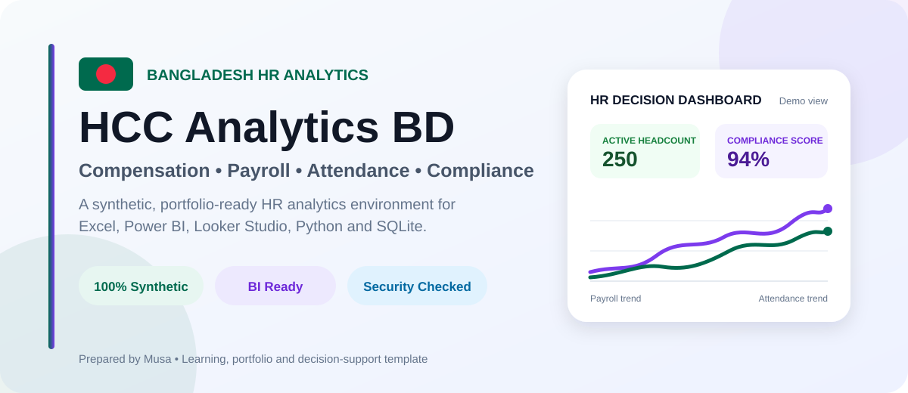
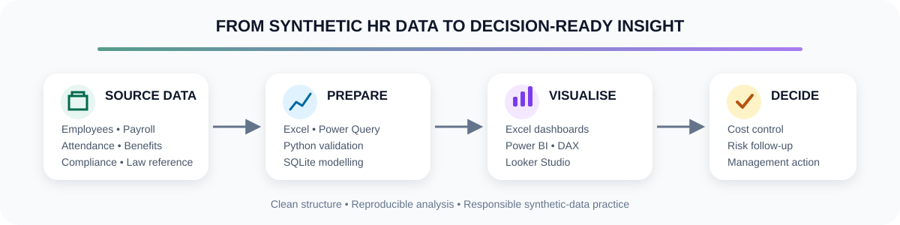
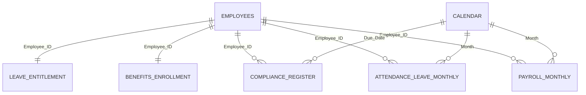

<p align="center">
  
</p>

<h1 align="center">🇧🇩 HCC Analytics BD</h1>

<p align="center">
  <strong>Bangladesh HR Compensation, Payroll, Attendance & Compliance Analytics</strong>
</p>

<p align="center">
  A structured, synthetic and portfolio-ready analytics environment for turning HR data into reliable workforce, payroll and compliance decisions.
</p>

<p align="center">
  <a href="#-project-overview">Overview</a> •
  <a href="#-quick-start">Quick Start</a> •
  <a href="#-dataset-map">Dataset Map</a> •
  <a href="#-core-hr-kpis">KPIs</a> •
  <a href="#-repository-structure">Structure</a> •
  <a href="#-documentation-hub">Documentation</a>
</p>

<p align="center">
  <a href="https://github.com/samusa099/hcc-analytics-bd/actions/workflows/security.yml"></a>
  <a href="https://github.com/samusa099/hcc-analytics-bd/actions/workflows/build-project.yml"></a>
  
  
  
  
  
  
</p>

> [!IMPORTANT]
> Every employee, payroll and compliance record in this repository is **synthetic demo data**. The project is designed for learning, portfolio presentation, testing and decision-support prototyping—not for storing real employee information.

---

## 🎯 Project Overview

HCC Analytics BD is an end-to-end HR analytics practice project built around the Bangladesh business context. It connects employee master data, monthly payroll, attendance, leave, benefits and compliance records so the same structured data can be analysed through multiple tools.

| Project dimension | Details |
|---|---|
| **Primary domains** | Compensation, payroll, attendance, leave, benefits and compliance |
| **Analytics tools** | Excel, Power BI, Looker Studio, Python and SQLite |
| **Data status** | 100% synthetic, portfolio-safe demo data |
| **Main audiences** | HR, Payroll, Finance, Compliance, Internal Audit and Management |
| **Project outputs** | Dashboards, clean CSV tables, KPI logic, SQL views, notebook analysis and documentation |
| **Current version** | `v1.2.0` |

### Business questions this project can help explore

- How is total workforce cost changing over time?
- Which departments contribute most to payroll and overtime cost?
- Where are attendance, lateness or working-hours exceptions concentrated?
- Are eligible employees receiving the expected benefits?
- Which compliance actions are high-risk, overdue or repeatedly unresolved?
- How can HR, Finance and Management reconcile workforce and payroll information?
- Which insights should be escalated from operational review to management action?

---

## ✨ What Is Included

| Component | What it provides | Best use |
|---|---|---|
| **Excel dashboards** | Two interactive dashboards with a guided starting point | Fast exploration, filtering and management presentation |
| **BI-ready CSV datasets** | Clean, connected HR tables with consistent analytical fields | Power BI, Looker Studio, Python and SQL import |
| **Data dictionary** | Field definitions, data types, BI roles and relationship guidance | Model design, documentation and validation |
| **HR KPI logic** | Payroll, headcount, attendance, leave, benefits and compliance calculations | Reusable business measures and audit checks |
| **Python notebook and pipeline** | Cleaning, validation and analytical workflow | Reproducible analysis and technical portfolio work |
| **SQLite database** | Relational tables, views and reusable SQL queries | Query practice and lightweight analytical applications |
| **Power BI guidance** | Data model, DAX measures, page blueprint and secure PBIX workflow | Professional dashboard development |
| **Looker Studio guide** | Calculated-field and reporting guidance | Lightweight browser-based dashboarding |
| **Security automation** | Dependency, static-analysis and repository checks | Safer project maintenance and release readiness |
| **Visual usage guide** | Supporting instructions and dashboard previews | Faster onboarding for new users |

---

## 🔄 Analytics Workflow

<p align="center">
  
</p>

The intended workflow is deliberately simple:

1. Start with the structured synthetic CSV tables.
2. Review field definitions in the data dictionary.
3. Clean and validate data through Excel, Power Query or Python.
4. Model relationships in Power BI, SQLite or another BI layer.
5. Build explicit HR measures and exception checks.
6. Present trends, drivers and risks—not only charts.
7. Convert findings into accountable management actions.

---

## 🚀 Quick Start

### Option A — Explore with Excel

1. Download or clone the repository.
2. Open `excel/Bangladesh_HR_Compensation_Compliance_Dashboards.xlsx`.
3. Begin from the `Start_Here` worksheet.
4. Use the month and business filters to explore dashboard outputs.
5. Review calculations before replacing any synthetic records.

### Option B — Build a Power BI or Looker Studio report

1. Import the required CSV files from `data/`.
2. Review `data/data_dictionary.csv` before defining relationships.
3. Use `employees.csv` as the primary employee dimension.
4. Connect payroll and attendance tables through `Employee_ID`.
5. Add a calendar table for monthly and date-based analysis.
6. Create explicit measures rather than relying only on automatic aggregation.
7. Follow the detailed [Power BI Usage Guide](powerbi/POWER_BI_USAGE_GUIDE.md) and the files in `bi/`.

### Option C — Analyse with Python and SQLite

1. Open the notebook and pipeline files inside `python_sqlite/`.
2. Install the documented Python dependencies.
3. Run validation and cleaning steps before analysis.
4. Query `hr_analytics.sqlite` or use the supplied SQL scripts and views.
5. Reconcile calculated results with the CSV or Excel totals.

```bash
git clone https://github.com/samusa099/hcc-analytics-bd.git
cd hcc-analytics-bd
```

---

## 🗺️ Dataset Map

| File / table | Analytical role | Typical analysis |
|---|---|---|
| `employees.csv` | Employee dimension | Headcount, department, grade, location, gender, tenure and status |
| `payroll_monthly.csv` | Monthly payroll fact | Gross pay, net pay, overtime, allowances, deductions and payment timing |
| `attendance_leave_monthly.csv` | Attendance fact | Attendance, absence, lateness, working hours, leave and overtime |
| `benefits_enrollment.csv` | Benefits snapshot | PF, insurance, medical, transport and meal coverage |
| `leave_entitlement.csv` | Leave snapshot | Entitlement, use, balance and utilisation |
| `compliance_register.csv` | Compliance fact | Risk, status, owner, due date, corrective action and closure |
| `law_reference.csv` | Reference table | Compliance-control mapping and policy-review support |
| `data_dictionary.csv` | Metadata and documentation | Definitions, data types, relationships and expected analytical use |
| `hr_analytics.sqlite` | Relational analytics database | SQL queries, views and Python integration |

### Recommended model relationships



> Keep dimensions and fact tables separate. Avoid combining every source into one wide table, because duplicated employee-level values can create unreliable totals.

---

## 📊 Core HR KPIs

| KPI | Basic calculation | Why it matters |
|---|---|---|
| **Active Headcount** | Distinct active employees | Workforce size and capacity |
| **Total Gross Payroll** | Sum of gross pay | Total labour-cost monitoring |
| **Total Net Payroll** | Sum of net pay | Payroll funding and bank-disbursement planning |
| **Average Gross Pay** | Gross payroll ÷ paid employees | Department, grade and workforce comparison |
| **Overtime Cost** | Sum of overtime pay | Staffing pressure and cost control |
| **Payroll Variance %** | Current vs previous month payroll | Identifying cost movements and drivers |
| **Attendance Rate** | Present days ÷ working days | Workforce availability |
| **Absenteeism Rate** | Absent days ÷ working days | Attendance risk and operational disruption |
| **Leave Utilisation %** | Leave used ÷ entitlement | Leave planning and entitlement monitoring |
| **Benefit Coverage %** | Enrolled eligible employees ÷ eligible employees | Benefit administration and exception detection |
| **Compliance Score %** | Compliant checks ÷ total checks | Overall control effectiveness |
| **Corrective Action Closure Rate** | Closed actions ÷ total actions | Accountability and remediation progress |

For formulas, examples and implementation notes, use the **[Complete Dataset Usage Guide](DATASET_USAGE_GUIDE.md)**.

---

## 🖥️ Recommended Dashboard Pages

A strong BI implementation can be organised into the following pages:

1. **Executive Overview** — headcount, payroll, attendance and compliance scorecard.
2. **Workforce Profile** — department, grade, location, employment type and tenure.
3. **Payroll & Overtime** — gross-to-net movement, cost drivers and exception review.
4. **Attendance & Leave** — absence, lateness, leave usage and working-hours controls.
5. **Benefits Coverage** — eligibility, enrolment and missing-coverage analysis.
6. **Pay Equity Review** — pay distribution by grade, department, tenure and gender.
7. **Compliance & Risk** — status, severity, due-date ageing, owner and closure tracking.
8. **Employee Drill-through** — a detailed synthetic employee investigation page.

> A portfolio dashboard should explain the **business question, model, insight, limitation and recommended action**. Attractive charts alone are not sufficient evidence of analytical skill.

---

## 🗂️ Repository Structure

```text
hcc-analytics-bd/
├── assets/readme/   README cover and workflow visuals
├── data/            Clean CSV datasets and data dictionary
├── excel/           Interactive Excel dashboards
├── bi/              Power BI and Looker Studio modelling resources
├── powerbi/         Power BI documentation and secure file workflow
├── python_sqlite/   Notebook, Python pipeline, SQLite database and SQL
├── guide/           Visual instructions and dashboard previews
├── scripts/         Reproducible project-generation utilities
├── docs/            Security and supporting project documentation
├── README.md        Main project landing page
└── RELEASE_NOTES.md Version-specific changes
```

### Folder selection guide

| You want to… | Start here |
|---|---|
| View the finished dashboard quickly | `excel/` |
| Import clean data into a BI tool | `data/` |
| Build Power BI measures and relationships | `bi/` and `powerbi/` |
| Run Python or SQL analysis | `python_sqlite/` |
| Understand every field and calculation | `DATASET_USAGE_GUIDE.md` |
| Review visuals and usage instructions | `guide/` |
| Review security decisions | `SECURITY.md` and `docs/` |

---

## 📚 Documentation Hub

- **[Complete Dataset Usage Guide](DATASET_USAGE_GUIDE.md)** — calculations, business use cases and multi-platform workflows.
- **[Power BI Folder Overview](powerbi/README.md)** — Power BI resources and file-handling guidance.
- **[Detailed Power BI Usage Guide](powerbi/POWER_BI_USAGE_GUIDE.md)** — model design, pages, KPIs, DAX, refresh, governance and validation.
- **[Data Model and Setup Guide](bi/data_model_and_setup.md)** — relationship and implementation guidance.
- **[Power BI DAX Measures](bi/power_bi_dax_measures.md)** — starter measure definitions.
- **[Release Notes](RELEASE_NOTES.md)** — current release changes and readiness updates.
- **[Contributing Guide](CONTRIBUTING.md)** — contribution process and synthetic-data requirements.
- **[Code of Conduct](CODE_OF_CONDUCT.md)** — expected standards for participation.
- **[Security Policy](SECURITY.md)** — responsible disclosure and data-protection rules.
- **[Security Review & Closure](docs/SECURITY_REVIEW_2026-07-24.md)** — findings, remediation and residual controls.

---

## 🔐 Security and Data Governance

This repository is structured as a public learning project, so its controls prioritise safe handling, reproducibility and transparency.

### Implemented baseline

- Routine GitHub Actions workflows use read-only repository permission.
- Official GitHub Actions are pinned to immutable commit SHAs.
- Bandit and `pip-audit` are included in automated checks.
- Dependabot monitors Python and GitHub Actions dependencies.
- Cleaned CSV exports neutralise spreadsheet-formula prefixes.
- CODEOWNERS covers workflows, scripts, data tooling and binary analytics assets.
- Branch protection requires changes to pass through a Pull Request and expected status checks.

### Never commit

- Real employee records or CVs.
- National ID, passport, tax or bank information.
- Salary sheets containing identifiable employee data.
- Credentials, API keys, tokens or connection strings.
- Confidential company policies, legal files or investigation records.

When adapting this project for an organisation, apply role-based access, data minimisation, controlled storage, retention rules and a formal approval process.

---

## 🎓 Learning and Portfolio Outcomes

This project can demonstrate the ability to:

- translate HR questions into measurable KPIs;
- organise multi-table workforce data into a reusable analytical model;
- clean and validate HR data across Excel and Python;
- write SQL queries and analytical views;
- build management dashboards in Excel and Power BI;
- interpret payroll, attendance and compliance exceptions responsibly;
- document assumptions, limitations and data-protection controls;
- communicate findings to HR, Finance, Audit and senior management audiences.

### Suggested portfolio presentation flow

1. **Problem:** Explain the HR or compliance decision that needs support.
2. **Data model:** Show how employee, payroll, attendance and compliance tables connect.
3. **Insight:** Present the key trend, driver or exception.
4. **Action:** Recommend a realistic owner, timeline and follow-up measure.

---

## ⚠️ Responsible Use and Limitations

This repository is a **learning, portfolio and decision-support template**. It is not legal, payroll, tax or regulatory advice.

Before applying any calculation in a live organisation, verify:

- the latest Bangladesh labour requirements;
- applicable sector wage gazettes;
- EPZ or non-EPZ applicability;
- current NBR income-tax rules;
- overtime and working-hour requirements;
- company policy, employment contracts and approved payroll practice.

Synthetic examples and configurable formulas must never replace professional legal, tax, payroll or compliance review.

---

## ⚖️ Licences

- **Dataset and documentation:** Creative Commons Attribution 4.0 — see [`LICENSE`](LICENSE).
- **Python, SQL and supporting code:** MIT — see [`LICENSE-CODE`](LICENSE-CODE).

---

## 👤 Author

**Musa**  
HR Professional • HR Analytics Learner • Bangladesh

<p align="center">
  <strong>People data becomes valuable only when it supports a clear, responsible decision.</strong>
</p>

<p align="center">
  ⭐ Star the repository if it supports your HR analytics learning or portfolio work.
</p>
