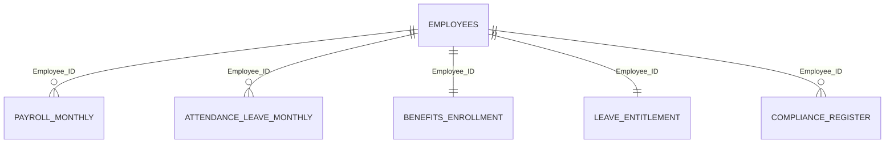

# Power BI & Looker Studio Data Model

## Recommended star schema

## Tables

- **Dimension:** `employees`
- **Facts:** `payroll_monthly`, `attendance_leave_monthly`, `compliance_register`
- **Snapshots:** `benefits_enrollment`, `leave_entitlement`
- **Reference:** `law_reference`, `data_dictionary`

## Power BI import

1. **Get Data → Folder** and select the `data` folder, or import the CSVs separately.
2. Set date columns to **Date**.
3. Create one-to-many relationships from `employees[Employee_ID]`.
4. Add a calendar table and relate it to payroll/attendance/compliance month columns.
5. Use the measures in `power_bi_dax_measures.md`.

## Looker Studio import

1. Upload the CSVs to Google Sheets or BigQuery.
2. Use `employees` as the employee dimension source.
3. Blend fact tables using `Employee_ID`; also match payroll/attendance month where necessary.
4. Use fields from `looker_studio_calculated_fields.md`.

> Minimum wage and tax logic are configurable. Update them with the current sector gazette and tax-year rules.
