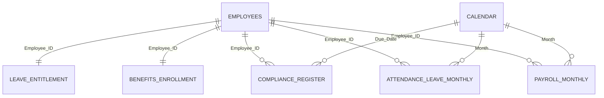

# 📊 Power BI Usage Guide

## Bangladesh HR Compensation & Compliance Analytics

This guide explains **how to use**, **where to use** and **how to design the best Power BI experience** for the HCC Analytics BD project.

**Prepared by:** Musa  
**Data type:** Fully synthetic demo data  
**Primary tools:** Power BI Desktop, Power Query, DAX and the CSV files in `data/`

---

# 1. 🎯 What this Power BI project is for

The project is designed as a complete HR analytics practice and demonstration environment. It combines workforce, payroll, attendance, leave, benefits and compliance information in one connected reporting model.

Use it to:

- turn raw HR files into decision-ready dashboards;
- practise Power Query cleaning and transformation;
- build a star-schema model with multiple fact tables;
- create reusable DAX measures;
- identify payroll, attendance and compliance exceptions;
- present HR insights to management, finance and audit audiences;
- build a professional HR analytics portfolio project.

---

# 2. 🧭 When Power BI is the best tool

Use Power BI when the requirement involves:

- multiple connected HR tables;
- recurring monthly refreshes;
- interactive filtering and drill-through;
- department, grade, location or gender comparisons;
- trend analysis across several months;
- management dashboards with controlled access;
- reusable measures rather than manual spreadsheet formulas;
- publishing through Power BI Service.

## When another tool may be better

| Requirement | Better starting tool |
|---|---|
| Correcting a few rows manually | Excel |
| Advanced statistical or predictive work | Python |
| Complex reusable data extraction | SQL / SQLite |
| Lightweight public dashboard | Looker Studio |
| Governed interactive management reporting | Power BI |

Power BI should normally be the **presentation and semantic-model layer**, not the place where every data-quality problem is hidden.

---

# 3. 🏢 Where this dashboard can be used

## A. HR Operations

Use it for:

- monthly headcount reporting;
- attendance and absence review;
- leave and lateness monitoring;
- employee-status checks;
- payroll and overtime exceptions;
- employee documentation follow-up.

### Decisions supported

- Which departments have rising absence?
- Which employees or teams have unusually high overtime?
- Are payroll records being processed on time?
- Which employee records need correction or follow-up?

---

## B. Compensation, Benefits and Rewards

Use it for:

- salary-cost analysis;
- grade and department pay comparison;
- allowance and deduction review;
- pay-equity exploration;
- PF, insurance and benefit coverage monitoring;
- total-reward discussion.

### Decisions supported

- Which departments have the highest average pay?
- Is overtime increasing total labour cost?
- Are eligible employees missing benefit enrolment?
- Are apparent pay gaps explained by grade, tenure or role mix?

---

## C. Finance and Payroll

Use it for:

- gross-to-net reconciliation;
- payroll-funding estimates;
- overtime and deduction analysis;
- month-over-month payroll variance;
- headcount-cost reconciliation;
- unusual payment detection.

### Decisions supported

- Why did payroll increase this month?
- Which cost component explains the variance?
- Are net-pay totals consistent with payroll records?
- Which departments contribute most to total labour cost?

---

## D. Compliance and Internal Audit

Use it for:

- compliance-score reporting;
- exception and risk tracking;
- overdue corrective-action follow-up;
- wage-payment and overtime-rate monitoring;
- audit evidence preparation;
- responsible-owner accountability.

### Decisions supported

- Which non-compliant items are high risk?
- Which owners have overdue actions?
- Is the closure rate improving?
- Which compliance controls fail repeatedly?

---

## E. Senior Management

Use it for:

- executive HR scorecards;
- workforce-cost review;
- department benchmarking;
- workforce-risk discussion;
- monthly and quarterly business reviews.

Management pages should remain concise. Show outcomes and exceptions, not every raw column.

---

## F. Learning, Recruitment and Portfolio Demonstration

Use it to demonstrate:

- HR domain understanding;
- data modelling and relationships;
- Power Query transformation;
- DAX measure development;
- dashboard design and storytelling;
- security and responsible-data practices;
- business recommendations based on synthetic evidence.

A strong portfolio presentation should explain the **business question, model, insight and recommended action**, not only show attractive charts.

---

# 4. 🗂️ Source files and their Power BI roles

| Source file | Recommended model role | Best uses |
|---|---|---|
| `employees.csv` | Employee dimension | Headcount, department, grade, location, gender, status and workforce segmentation |
| `payroll_monthly.csv` | Payroll fact | Gross pay, net pay, overtime, allowances, deductions and payment compliance |
| `attendance_leave_monthly.csv` | Attendance fact | Attendance rate, absence, lateness, leave and working-hour analysis |
| `benefits_enrollment.csv` | Employee benefit snapshot | PF, insurance, medical, meal and transport coverage |
| `leave_entitlement.csv` | Leave snapshot | Entitlement, use and balance analysis |
| `compliance_register.csv` | Compliance fact | Status, risk, owner, due date, corrective action and closure tracking |
| `law_reference.csv` | Reference table | Control mapping and policy-review support |
| `data_dictionary.csv` | Documentation reference | Field definitions, data types, BI roles and relationship guidance |

---

# 5. 🧱 Recommended data model

Use a star-schema approach:



## Modelling rules

- Use `employees` as the primary employee dimension.
- Use one-to-many relationships from `employees[Employee_ID]` to fact tables.
- Prefer single-direction filtering from dimensions to facts.
- Add a dedicated calendar table.
- Mark the calendar as the official date table.
- Hide technical key columns from report consumers.
- Avoid many-to-many relationships unless the business requirement truly needs them.
- Do not merge every table into one wide flat table; that creates duplication and unreliable totals.

Detailed setup: [`../bi/data_model_and_setup.md`](../bi/data_model_and_setup.md)

---

# 6. 🖥️ Best report-page blueprint

## Page 1 — Executive Overview

### Purpose

Give management a reliable one-page summary of workforce cost, attendance and compliance.

### Recommended KPIs

- Active Headcount
- Total Gross Payroll
- Total Net Payroll
- Total OT Cost
- Average Attendance %
- Compliance Score %
- Open Compliance Exceptions
- Paid On Time %

### Recommended visuals

- KPI cards across the top
- Monthly payroll trend
- Department headcount and payroll comparison
- Attendance trend
- Compliance status donut or bar
- High-risk exception table

### Best slicers

- Month
- Department
- Location
- Grade
- Employment Type

### Management action

Use this page to decide where a deeper investigation is required.

---

## Page 2 — Workforce Profile

### Recommended KPIs

- Active Headcount
- Inactive Headcount
- Female Headcount %
- Average Tenure
- Department Headcount Share

### Recommended visuals

- Headcount by department
- Headcount by grade
- Gender distribution
- Employment-type distribution
- Location distribution
- Join-date or tenure distribution

### Questions answered

- Where is the workforce concentrated?
- Which departments or grades are expanding?
- What is the workforce composition?
- Where are succession or retention concerns likely to emerge?

---

## Page 3 — Payroll and Overtime

### Recommended KPIs

- Total Gross Payroll
- Total Net Payroll
- Average Gross Pay
- Total OT Cost
- Payroll Variance
- Deduction Ratio
- Paid On Time %

### Recommended visuals

- Gross and net payroll trend
- Payroll by department
- OT cost by department
- Top OT employees
- Allowance composition
- Deduction composition
- Payroll exception table

### Questions answered

- What is driving monthly payroll changes?
- Which teams have high overtime dependency?
- Are deductions or allowances unusually high?
- Are payment-timing controls being met?

---

## Page 4 — Attendance and Leave

### Recommended KPIs

- Average Attendance %
- Absenteeism Rate
- Total Late Days
- Average OT Hours
- Leave Utilisation %
- Working-Hours Compliance %

### Recommended visuals

- Attendance trend
- Absence by department
- Late-frequency ranking
- Leave-used versus entitlement
- OT hours versus attendance
- Working-hours exception table

### Questions answered

- Which departments have recurring absence?
- Is overtime associated with low attendance or staffing pressure?
- Which employees are approaching leave limits?
- Where do working-hour exceptions require review?

---

## Page 5 — Benefits Coverage

### Recommended KPIs

- PF Coverage %
- Insurance Coverage %
- Medical Benefit Coverage %
- Transport Coverage %
- Meal Benefit Coverage %
- Eligible but Not Enrolled

### Recommended visuals

- Coverage by benefit type
- Eligible versus enrolled employees
- Coverage by department
- Benefit gap table

### Questions answered

- Which eligible employees are not enrolled?
- Which departments have weaker benefit coverage?
- Are benefit rules applied consistently?

---

## Page 6 — Pay Equity

### Recommended KPIs

- Female Average Gross Pay
- Male Average Gross Pay
- Pay Equity Ratio
- Median Pay by Gender
- Grade-adjusted comparison

### Recommended visuals

- Average pay by gender and grade
- Pay distribution by department
- Box plot or distribution visual when trusted and available
- Scatter plot of pay versus tenure
- Detail table with department, grade, tenure and employment type

### Interpretation rule

A pay-equity ratio alone does not prove discrimination. Always review grade, job family, tenure, location, performance and working-hour differences before drawing conclusions.

---

## Page 7 — Compliance and Risk

### Recommended KPIs

- Compliance Score %
- Open Exceptions
- High-Risk Exceptions
- Overdue Actions
- Corrective Action Closure Rate
- OT Rate Compliance %
- Wage-Floor Compliance %

### Recommended visuals

- Compliance status by topic
- Exceptions by risk level
- Exceptions by responsible owner
- Due-date ageing
- Monthly closure trend
- High-risk exception action table

### Questions answered

- Which controls require immediate attention?
- Who owns each corrective action?
- Which actions are overdue?
- Is compliance performance improving?

---

## Page 8 — Employee Drill-through

Use one drill-through page for a synthetic employee profile containing:

- employee master information;
- recent payroll records;
- attendance and leave summary;
- benefits enrolment;
- compliance exceptions;
- relevant trend charts.

This page is useful for investigation but should not be the opening management page.

---

# 7. 🧮 Core DAX measures

The repository already contains starter measures in:

[`../bi/power_bi_dax_measures.md`](../bi/power_bi_dax_measures.md)

Recommended measures include:

```DAX
Total Gross Payroll = SUM(payroll_monthly[Gross_Pay])

Total Net Payroll = SUM(payroll_monthly[Net_Pay])

Total OT Cost = SUM(payroll_monthly[OT_Pay])

Average Gross Pay = AVERAGE(payroll_monthly[Gross_Pay])

Active Headcount =
CALCULATE(
    DISTINCTCOUNT(employees[Employee_ID]),
    employees[Active_Status] = "Active"
)

Compliance Score % =
DIVIDE(
    CALCULATE(
        COUNTROWS(compliance_register),
        compliance_register[Status] = "Compliant"
    ),
    COUNTROWS(compliance_register)
)
```

## Recommended measure discipline

- Create explicit measures instead of relying on implicit sums.
- Store measures in a dedicated measure table.
- Use `DIVIDE()` rather than direct division.
- Format ratios as percentages and costs consistently.
- Validate every KPI against the source CSV or Excel totals.
- Keep business logic out of visual-level filters when it should be reusable.

---

# 8. 🛠️ How to build the report

## Step 1 — Prepare the files

- Download or clone the repository.
- Keep the `data/` folder structure unchanged.
- Confirm the CSV files open correctly.
- Review `data_dictionary.csv` before modelling.

## Step 2 — Import into Power BI

1. Open Power BI Desktop.
2. Select **Get Data → Text/CSV**.
3. Import the required files from `data/`.
4. Select **Transform Data** instead of loading immediately.

## Step 3 — Clean in Power Query

- set dates to Date type;
- set salary, cost and hour fields to numeric types;
- trim and clean text values;
- standardise Yes/No and status values;
- remove unnecessary columns;
- check for duplicate employee keys;
- document important transformation steps;
- disable load for staging queries that are not used by the model.

## Step 4 — Build relationships

- connect fact tables to `employees` using `Employee_ID`;
- connect monthly tables to the calendar;
- verify cardinality and filter direction;
- confirm that totals do not multiply after relationships are created.

## Step 5 — Create measures

- start with the repository’s DAX guide;
- build measures before designing visuals;
- test each measure with a basic table;
- compare totals against the original source files.

## Step 6 — Design pages

- use a consistent grid and spacing;
- keep no more than a small set of important KPIs at the top;
- use one colour meaning consistently for warnings or exceptions;
- include a report date and last-refresh indicator;
- use tooltips and drill-through for detail;
- avoid overloaded pages and decorative charts with no decision value.

## Step 7 — Validate

- reconcile headcount;
- reconcile gross and net payroll totals;
- verify attendance and compliance percentages;
- test slicers and cross-filtering;
- test empty and edge-case selections;
- check that no visual exposes unintended fields.

## Step 8 — Share safely

- clear credentials and permissions;
- remove personal local paths;
- confirm only synthetic data is embedded;
- test Row-Level Security when used;
- publish only to an approved workspace;
- document refresh ownership.

---

# 9. 🔄 Monthly refresh workflow

A practical recurring workflow is:

1. Replace or append the latest monthly synthetic CSV records.
2. Validate column names and data types.
3. Refresh Power Query.
4. Review refresh errors and rejected rows.
5. Reconcile payroll and headcount totals.
6. Review exception tables.
7. Update the report month and refresh timestamp.
8. Publish the validated version.
9. Archive the previous release where required.

For real organisational use, add a formal data owner, approval step and documented reconciliation control.

---

# 10. 🔐 Security and governance

Before uploading or publishing:

- remove API keys, passwords and tokens;
- clear cached credentials;
- replace local machine paths with parameters;
- inspect Power Query M code;
- remove private server names and gateway references;
- use trusted custom visuals only;
- test Row-Level Security roles;
- confirm workspace permissions follow least privilege;
- avoid exporting employee-level details unnecessarily;
- define retention and versioning rules.

The repository contains synthetic data, but the same report design used with real data would require stronger privacy and access controls.

---

# 11. ✅ Quality checklist

## Data

- [ ] Employee IDs are unique in the employee dimension.
- [ ] Fact-table employee IDs match the employee dimension.
- [ ] Date, numeric and text data types are correct.
- [ ] Blank and duplicate records have been reviewed.
- [ ] All data is synthetic or approved for use.

## Model

- [ ] Relationships use the intended cardinality.
- [ ] Filter direction is controlled.
- [ ] A calendar table is present.
- [ ] Technical columns are hidden.
- [ ] Measures are explicit and documented.

## Report

- [ ] KPIs reconcile with source totals.
- [ ] Slicers work across relevant visuals.
- [ ] Pages are readable at normal zoom.
- [ ] Colours and labels are consistent.
- [ ] Exception visuals lead to a clear action.
- [ ] Drill-through pages return the expected records.

## Security

- [ ] Credentials and private paths are removed.
- [ ] Trusted connectors and visuals are used.
- [ ] RLS is tested when applicable.
- [ ] Workspace access is reviewed.
- [ ] The file is scanned before public upload.

---

# 12. ⚠️ Limitations and responsible interpretation

This project is intended for learning, portfolio development and decision-support design.

Do not treat the demo calculations as final legal or payroll rules. Before real use, verify:

- current Bangladesh labour requirements;
- applicable sector and wage gazettes;
- EPZ or special-zone applicability;
- tax-year and payroll rules;
- employment contracts and company policy;
- collective agreements where relevant;
- privacy and retention obligations.

A dashboard highlights patterns and exceptions. It does not replace professional investigation, legal review or employee consultation.

---

# 13. 🔗 Related resources

- [`README.md`](README.md)
- [`../bi/data_model_and_setup.md`](../bi/data_model_and_setup.md)
- [`../bi/power_bi_dax_measures.md`](../bi/power_bi_dax_measures.md)
- [`../data/data_dictionary.csv`](../data/data_dictionary.csv)
- [`../DATASET_USAGE_GUIDE.md`](../DATASET_USAGE_GUIDE.md)
- [`../excel/Bangladesh_HR_Compensation_Compliance_Dashboards.xlsx`](../excel/Bangladesh_HR_Compensation_Compliance_Dashboards.xlsx)

---

> 💡 **Best practice:** Build the report so that every page answers a business question, every KPI has a defined calculation and every exception leads to an accountable next action.
